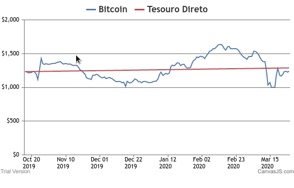

# Desafio Real Valor

<h1 align="center">
  
</h1>

<h3 align="center">
  Análise de Investimentos
</h3>

## 🚀 Sobre o desafio

Single Page Application que mostra como foi a rentabilidade de 2 investimentos: "Bitcoin" e "Tesouro Direto pré-fixado".
O usuário pode escolher a data (até dois anos atrás) e informar o investimento realizado, então o site irá gerar o gráfico de como o dinheiro investido rendeu ao longo do tempo.

## ⚙️ Tecnologias

#### Front-end

- ReactJS
- Styled Components
- CanvasJS
- Axios
- Redux

## 🖥️ Rodando o site localmente

Abrimos uma nova aba e acessamos o diretorio clonado.

```
cd Desafio-Real-Valor
```

E então iniciamos o servidor de desenvolvimento digitando.

```
yarn start
```

Caso não possua o yarn instalado digite.

```
npm run start
```

## 🖥️ Utilizando a plataforma

#### Podemos ampliar o gráfico selecionando uma parte do mesmo.
<h1 align="center">
  
</h1>

#### Acesse o site agora mesmo clicando <a href="https://desafio-real-valor.netlify.com">aqui</a>

## 📝 License

This software comes with the hyper-permissive [MIT LICENSE](LICENSE.md).